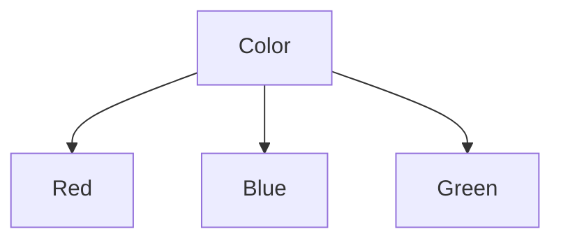

# ID3 Entropy Problem

- [ID3 Entropy Problem](#id3-entropy-problem)
  - [1. For the following data set, apply ID3 separately, and show all steps of derivation (computation, reasoning, developing/final decision trees, and rules)](#1-for-the-following-data-set-apply-id3-separately-and-show-all-steps-of-derivation-computation-reasoning-developingfinal-decision-trees-and-rules)
    - [1. Calculating Initial Entropy](#1-calculating-initial-entropy)
    - [2. For every feature we will calculate entropy and information gain](#2-for-every-feature-we-will-calculate-entropy-and-information-gain)

## 1. For the following data set, apply ID3 separately, and show all steps of derivation (computation, reasoning, developing/final decision trees, and rules)

|     | color | shape  | size  | class |
| --- | ----- | ------ | ----- | ----- |
| 1   | red   | square | big   | +     |
| 2   | blue  | square | big   | +     |
| 3   | red   | round  | small | -     |
| 4   | green | square | small | -     |
| 5   | red   | round  | big   | +     |
| 6   | green | round  | big   | -     |

$Entropy\left(t\right)=-\sum _jp\left(j\mid \:t\right)log_2\:p\left(j\mid t\right)$

Here class is the target attribute and has two values (`+` and `-`).
So it is a binary classification problem.

For a binary classification problem

- If all examples are positive or all are negative then entropy will be _zero_
  (i.e. low).
- If half of the examples are positive class and half are negative class
  then entropy is **one** (i.e. high).

### 1. Calculating Initial Entropy

Out of 6 instances, 3 are `+` and 3 are `-`

$P\left(+\right)=-\left(\frac{3}{6}\right)\cdot log_2\:\left(\frac{3}{6}\right)=0.5$

$P\left(-\right)=-\left(\frac{3}{6}\right)\cdot log_2\:\left(\frac{3}{6}\right)=0.5$

$Entropy\left(t\right)=E\left(t\right)=0.5\:+\:0.5\:=\:1$

**Note**: 1 indicates that the classes are highly impure. It is true in our
case as there are equal number of observations with target class `+` and `-`

### 2. For every feature we will calculate entropy and information gain

**For attribute color**:

$E\left(Color\:=\:red\right)=-\frac{2}{3}\cdot log_2\:\frac{2}{3}-\frac{1}{3}\cdot log_2\:\frac{1}{3}\approx 0.92$

$E\left(Color\:=\:blue\right)=-\frac{1}{1}\cdot log_2\:\frac{1}{1}-0=0$

$E\left(Color\:=\:green\right)=-0-\frac{2}{2}\cdot log_2\:\frac{2}{2}=0$

$Average\:Entropy\:=\:\frac{3}{6}\left(0.92\right)+\frac{1}{6}\left(0\right)+\frac{2}{6}\left(0\right)=0.46$

$Gain\left(Outlook\right)=1-0.46=0.54$

**For attribute shape**:

$E\left(shape=square\right)=-\frac{2}{3}\cdot log_2\:\frac{2}{3}-\frac{1}{3}\cdot log_2\:\frac{1}{3}\approx 0.92$

$E\left(shape=round\right)=-\frac{1}{3}\cdot log_2\:\frac{1}{3}-\frac{2}{3}\cdot log_2\:\frac{2}{3}=0.92$

$Average\:Entropy\:=\:\frac{3}{6}\left(0.92\right)+\frac{3}{6}\left(0.92\right)=0.92$

$Gain\left(Outlook\right)=1-0.54=0.46$

**For attribute size**:

$E\left(size=big\right)=-\frac{3}{4}\cdot log_2\:\frac{3}{4}-\frac{1}{4}\cdot log_2\:\frac{1}{4}\approx 0.81$

$E\left(size=small\right)=0-\frac{2}{2}\cdot log_2\:\frac{2}{2}=0$

$Average\:Entropy=\frac{4}{6}\left(0.81\right)+\frac{2}{6}\left(0\right)=0.54$

$Gain\left(Outlook\right)=1-0.54=0.46$

---

Feature ‘color’ provides more information on the ‘class’ as it has the highest
information gain and hence will be chosen as the first splitting attribute.

Likewise, we create the entire tree by selecting the splitting attribute as the
attribute that gives the most information.
