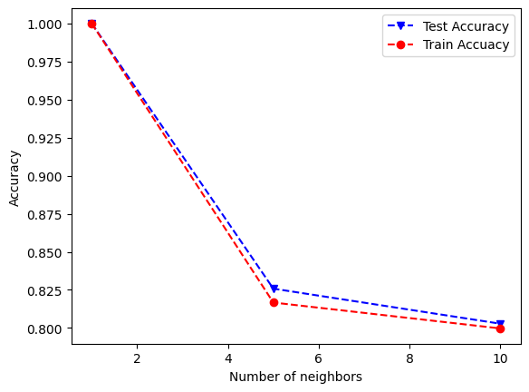
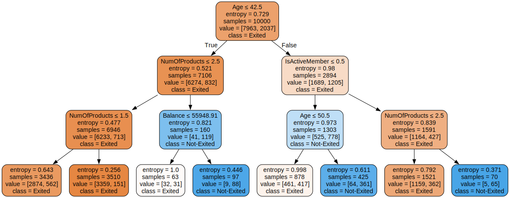
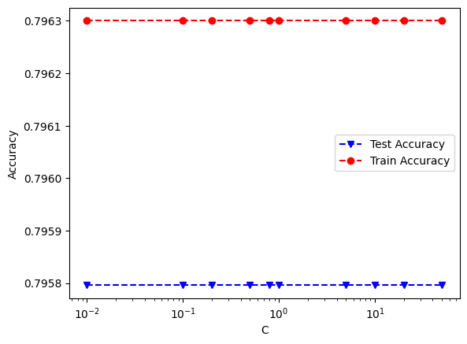

# Accuracy Analysis and Some Figures

| ML Model    | Accuracy on Test Set in Percent |
| ----------- | ------------------------------- |
| Naive Bayes | 78                              |
| KNN         | 80                              |
| SVM         | 80                              |
| DT          | 84                              |
| Logit       | 80                              |

See [assignment03_part_3_Classification_Models_ian_schultz.ipynb](assignment03_part_3_classification_models_ian_schultz.ipynb)
to see how the above percentages were computed.

## Some graphs

How accuracy changes based on number of neighbors:

**Interpretation**:

The accuracy is high with 1 neighbor because of the small sample size.
Basically, these two graphs being similar shows that the test/train split was
not egregious. The split did not adversely affect the training.

## The decision tree

Based on our accuracy analysis, following this tree leads to the right
categorization around 80% of the time, depending on the model.

The below graph (notice the y axis) shows that the test and train accuracy
differences were not significant. This implies that the dataset was not split
in a way that decreases the effectiveness of training.

